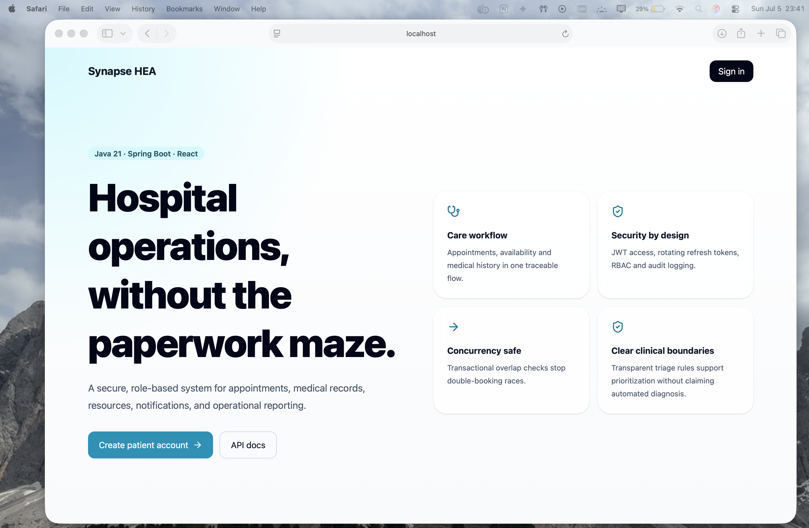
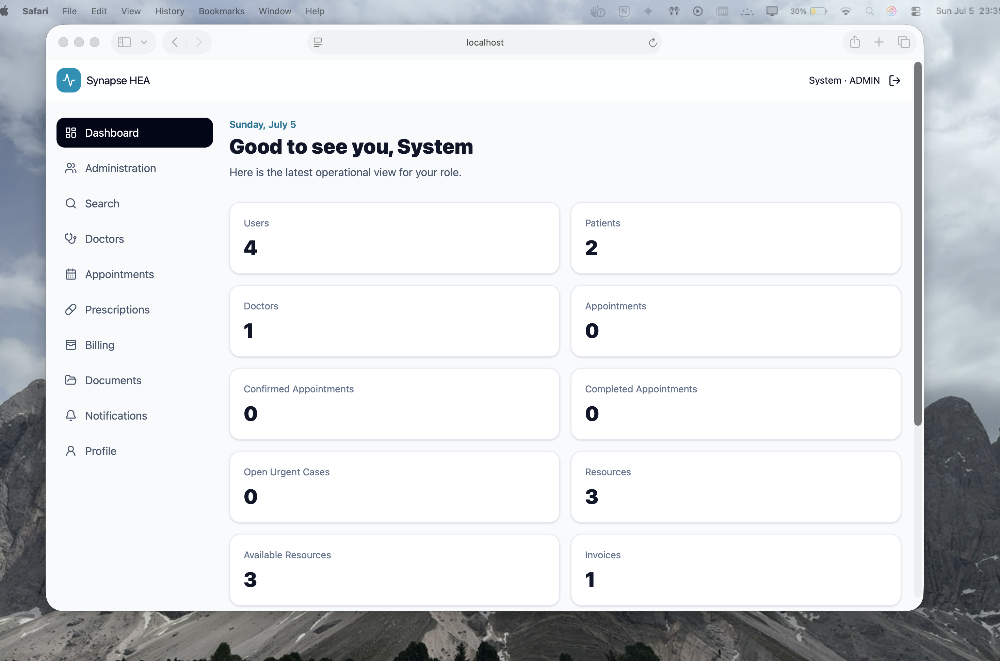
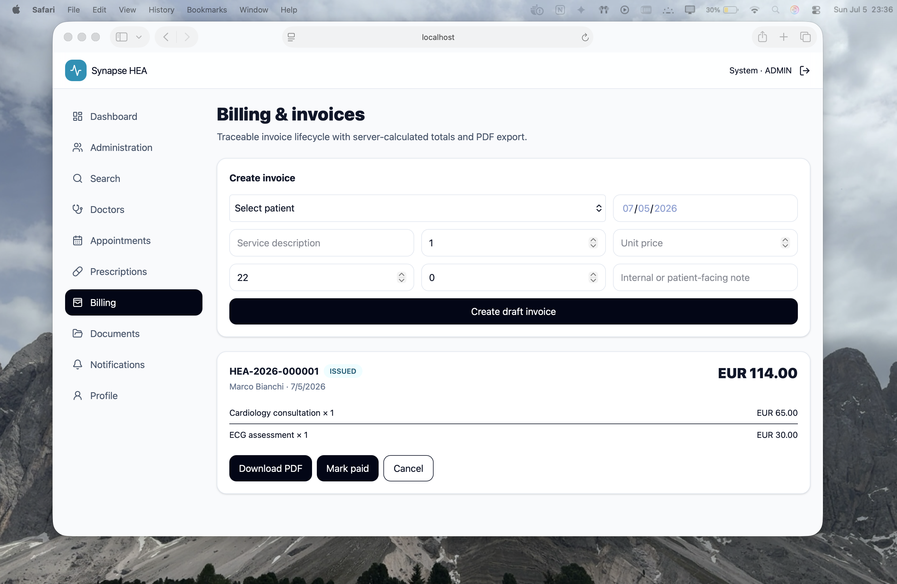
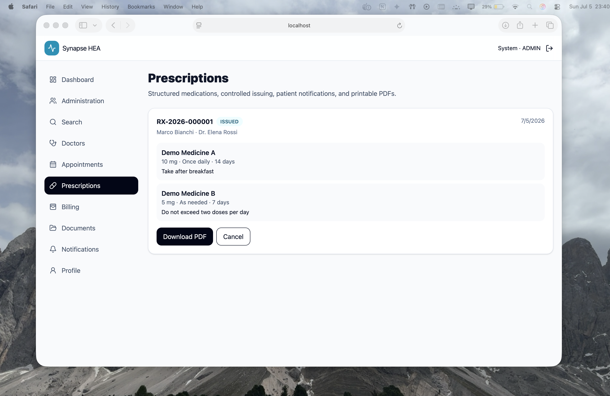

# Synapse HEA — Hospital Management System

A full-stack rebuild of the original Synapse/HEA university project using **Java 21, Spring Boot, React, TypeScript, Tailwind CSS, MySQL, Redis, Docker, Nginx, SQL, YAML, and shell scripting**.

The repository uses a **modular-monolith architecture** instead of unnecessary microservices. This keeps the domain modules separated while making development, testing, and deployment easier to manage.

> Educational software only. It is not a certified medical device. Do not use real patient data without professional privacy, security, legal, and clinical review.

## Release 2.0 — Phase 2

### Patient capabilities

- Registration, authentication, refresh-token rotation, logout, and password management
- Appointment booking, rescheduling, cancellation, history, and notifications
- Medical-record, prescription, invoice, and clinical-document access
- Prescription and invoice PDF downloads
- PDF/JPEG/PNG/TXT report uploads with a 10 MB limit
- Role-specific dashboard metrics

### Doctor capabilities

- Appointment workflow and clinical record creation
- Structured prescriptions with medication, dosage, frequency, duration, instructions, issue/cancel lifecycle, and PDF export
- Custom availability blocks with overlap prevention and removal
- Role-restricted patient-document upload and retrieval
- Transparent urgent-case prioritization support
- Persisted, live, and optionally emailed notifications

### Administrator capabilities

- Account status and hospital-resource management
- Department creation and maintenance
- Invoice creation, server-side total calculation, issue/payment/cancellation lifecycle, and PDF export
- Searchable audit trail and expanded operational analytics
- Patient, doctor, appointment, resource, revenue, invoice, prescription, and document metrics

### Engineering controls

- Java 21 and Spring Boot 3.5
- Short-lived HMAC JWT access tokens and rotating opaque refresh tokens
- BCrypt password hashing and Spring Security RBAC
- Transactional appointment conflict prevention
- MySQL with Flyway migrations and optimistic locking
- Redis caching and Server-Sent Events notifications
- Optional SMTP email delivery with a safe logging fallback for local development
- Controlled document storage with generated filenames and metadata in MySQL
- Dependency-free deterministic PDF generation for invoices and prescriptions
- Bean validation, global error responses, pagination, and audit logging
- Swagger/OpenAPI, Actuator, Prometheus metrics, Docker Compose, and GitHub Actions CI

## Screenshots

### Landing page



### Administrator dashboard



### Billing and invoices



### Prescriptions



---

## Architecture

```text
React 19 + TypeScript + Tailwind
              │
         Nginx / JSON
              │
Spring Boot REST API ── Security / JWT / RBAC
              │
       Modular application services
       ┌──────────┼────────────┐
   MySQL 8.4   Redis 7.4   Document volume
```

The main modules are authentication, users, departments, doctors, appointments, medical records, prescriptions, billing, documents, notifications, urgent cases, resources, audit, search, and dashboards.

See [`docs/architecture.md`](docs/architecture.md), [`docs/phase-2.md`](docs/phase-2.md), and [`docs/adr`](docs/adr).

## Run with Docker

### Requirements

- Docker Desktop with Docker Compose
- Git

```bash
git clone https://github.com/nomannn13/synapse-hea-healthcare-system.git
cd synapse-hea-healthcare-system
cp .env.example .env
docker compose up --build
```

Open:

- Web application: `http://localhost:3000`
- Swagger UI: `http://localhost:8080/swagger-ui.html`
- API health: `http://localhost:8080/actuator/health`
- Prometheus metrics: `http://localhost:8080/actuator/prometheus`

MySQL is exposed on host port **3307** by default to avoid clashing with a local MySQL installation. Containers still communicate internally on port 3306.

### Demo accounts

All seeded accounts use `Password123!`.

| Role | Email |
| --- | --- |
| Patient | `patient@synapse.local` |
| Doctor | `doctor@synapse.local` |
| Administrator | `admin@synapse.local` |

The Phase 2 seed includes one demo issued invoice and one demo issued prescription for the patient account.

## Upgrade an existing local v1 installation

Keep the existing MySQL volume so Flyway can apply migrations V4 and V5:

```bash
docker compose down
docker compose up --build
```

Use `docker compose down -v` only when you intentionally want to delete all local database and document data.

## Optional SMTP email

Local development logs emails instead of sending them. To enable SMTP, update `.env`:

```env
MAIL_ENABLED=true
MAIL_FROM=no-reply@example.com
SMTP_HOST=smtp.example.com
SMTP_PORT=587
SMTP_USERNAME=your-user
SMTP_PASSWORD=your-password
SMTP_AUTH=true
SMTP_STARTTLS=true
```

Never commit real SMTP credentials.

## Run without Docker

Start MySQL 8.4 and Redis locally, then:

```bash
cd backend
mvn spring-boot:run
```

In another terminal:

```bash
cd frontend
npm install
npm run dev
```

For local MySQL on port 3307, set:

```bash
export DB_URL='jdbc:mysql://localhost:3307/synapse_hea?useSSL=false&allowPublicKeyRetrieval=true&serverTimezone=UTC'
```

## Test and build

```bash
cd backend
mvn verify

cd ../frontend
npm ci
npm run check
```

## Repository structure

```text
backend/                  Java 21 / Spring Boot API
frontend/                 React / TypeScript / Tailwind UI
docs/                     Architecture, ADRs, API and traceability
postman/                  Importable API collection
scripts/                  Local workflow and smoke-test helpers
.github/workflows/ci.yml  CI pipeline
docker-compose.yml        MySQL, Redis, API, frontend and document volume
```

## Important boundaries

- The triage module prioritizes operational attention; it does not diagnose disease.
- Local document storage is suitable for development and single-node deployment. Production should use encrypted managed object storage with malware scanning, retention controls, and backups.
- Email delivery is best-effort and should move to an outbox/queue architecture at higher scale.
- External payments, national health systems, medical devices, insurance adjudication, and telemedicine are outside this release.
- TLS termination, secrets management, backups, disaster recovery, consent, retention, and regulatory compliance are deployment responsibilities.

## Original-project alignment

This rebuild keeps the practical actor set—patient, doctor, and administrator—and implements the central requirements from the HEA delivery: appointments, medical records, departments, resources, billing records, prescriptions, role-based access, dashboards, audit logging, notifications, real-time availability, and reliable error handling.

## My contribution

I worked on understanding, integrating, testing, and documenting the full-stack application. My work included backend and frontend integration, authentication and role-based access, database configuration, Docker-based setup, API testing, and technical documentation.

Through this project, I gained practical experience with Java, Spring Boot, React, TypeScript, REST APIs, MySQL, Redis, Docker, software architecture, security concepts, and Git-based development.


## License

MIT. See [`LICENSE`](LICENSE).
