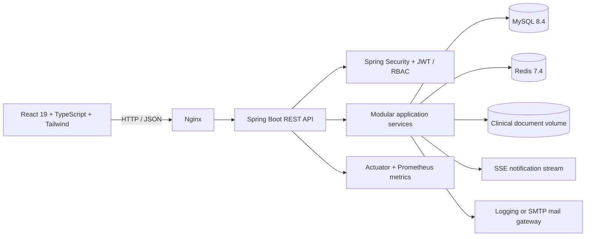

# Architecture

## Backend boundaries

- `auth`: registration, login, refresh rotation, logout, password reset, and mail abstraction.
- `user`: account and profile ownership.
- `department`: department discovery and administrator maintenance.
- `doctor`: doctor discovery and custom availability blocks.
- `appointment`: conflict-safe booking lifecycle.
- `medical`: role-protected clinical records.
- `prescription`: structured medications, lifecycle, and PDF export.
- `billing`: invoice aggregates, server-side monetary calculations, lifecycle, and PDF export.
- `document`: clinical metadata, storage abstraction, download, and deletion.
- `urgent`: operational triage prioritization; never automated diagnosis.
- `notification`: persisted notifications, SSE, and optional email delivery.
- `resource`: beds, rooms, and equipment.
- `audit`: immutable activity records and filtered queries.
- `search`: role-aware cross-domain search.
- `dashboard`: role-specific backend aggregation.
- `admin`: accounts, resources, audits, and operational reports.

## Request flow

Controller validates transport input → service enforces business rules and authorization → repository performs persistence → DTO defines the response → global exception handling emits a stable error contract.

## Storage choices

- MySQL owns relational records and metadata.
- Redis owns short-lived cache entries.
- Clinical file bytes are stored in a mounted volume through `FileStorageService`; metadata remains in MySQL.
- Invoice and prescription PDFs are generated on demand and are not persisted.

## Concurrency and consistency

- Appointment booking locks the doctor row and rechecks overlaps inside the transaction.
- Availability blocks reject overlap at creation time.
- JPA `@Version` fields provide optimistic locking for mutable aggregates.
- Invoice totals use `BigDecimal` and are calculated only on the server.
